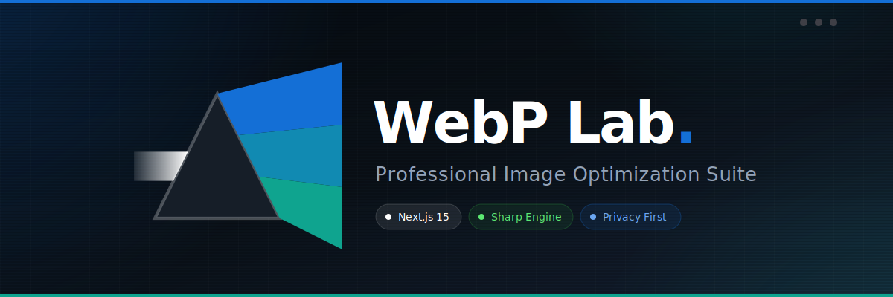

<div align="center">
  

  <h3>⚡ Professional Image Optimization Suite ⚡</h3>
  
  <p align="center">
    <a href="https://web-p-lab.vercel.app/" target="_blank">
      
    </a>
    
    
    
    
  </p>
  
  <p><em>"Optimización masiva de imágenes sin sacrificar calidad, velocidad ni privacidad."</em></p>
</div>

---

## Project Purpose

**WebP Lab** is an advanced web-based image processing platform designed to provide full control over the conversion and optimization of visual assets. It centralizes professional editing tools and cutting-edge compression algorithms in an intuitive and fluid interface.

The primary goal of WebP Lab is to provide web designers and developers with a secure and powerful environment to prepare images for the modern web. Unlike conventional online tools, this platform allows for local batch processing of large files, ensuring privacy and removing size or quantity restrictions.

---

## Key Features

### 1. Intelligent Multi-Format Conversion
*   Full support for WebP, AVIF, JPEG, PNG, and HEIC/HEIF.
*   Real-time file size impact estimation before download.
*   Automatic transparency detection and compatibility alerts.
*   Server-generated HEIC previews so browsers without native HEIC rendering can still show thumbnails correctly.

### 2. Dual Work Modes
*   Easy Mode (Smart Presets): Preconfigured profiles for specific goals (Fast Web, Social Media, Max Quality). Ideal for users seeking speed without technical complexities.
*   Expert Mode (Manual Control): Absolute control over compression parameters, chroma subsampling, metadata, and advanced filters.

### 3. Professional Editing Engine
*   Color Adjustments: Brightness, contrast, saturation, gamma, and hue.
*   Stylized Filters: Grayscale, sepia, blur, and sharpening.
*   Transformation: Precision rotation, horizontal/vertical flip.
*   Smart Crop: Entropy-based algorithm to automatically identify and preserve the image's center of interest.

### 4. Automation and Watermarking
*   Dynamic Watermarking: Batch apply text watermarks with control over opacity, size, position, and repeating patterns.
*   SEO Naming Patterns: Dynamic name generator using tags like [name], [width], [height], [format], and [date].

### 5. Efficient Workflow
*   Batch Processing: Upload multiple files and process them in a single asynchronous pipeline.
*   Flexible Download Options: Individual downloads, ZIP packaging, or direct saving to local folders (via File System Access API).
*   Session History: Persistent log of achieved savings and completed tasks.

---

## Technical Stack

This application uses a modern technology stack to ensure maximum performance:

*   **Framework:** Next.js (React 19) with App Router.
*   **Image Processing:** Sharp for the main pipeline plus `libheif` tools (`heif-enc` / `heif-dec`) for HEIC input/output.
*   **Styling:** Vanilla CSS with Tailwind CSS v4 support for dynamic utilities.
*   **Animations:** Framer Motion for a fluid and reactive user experience.
*   **Iconography:** Lucide React.
*   **Packaging:** JSZip for client-side compressed file management.

---

## 🚀 Engineering & Technical Highlights

As an engineering piece, **WebP Lab** solves several common challenges in web tools involving file processing:

1.  **Architecture:** Utilizes Next.js Server Components and API Routes to offload heavy image processing (like Sharp) onto the server side, keeping the client completely lightweight and reactive.
2.  **State Management & Performance:** Implements a high-performance state management approach for handling massive simultaneous file uploads while preventing browser memory leaks using modern React 19 standards.
3.  **Security & Privacy First:** No images are ever saved persistently on external servers. Processing occurs entirely within isolated execution contexts and files are immediately garbage-collected after streaming the converted output back to the client.
4.  **Responsive Engineering:** Implements mobile-first css abstractions and fluid animation handoffs using `framer-motion` to ensure identical layout fidelity from 4K monitors down to mobile viewports.
5.  **Dynamic Concurrency:** Limits active workers depending on the `.env` settings to prevent overwhelming the server with massive batch processing workloads.

---

## Installation and Setup

### Prerequisites
1.  Node.js: Version 18.x or higher is required.
2.  Package Manager: npm (comes with Node.js) or yarn/pnpm.
3.  For HEIC/HEIF support: `heif-enc` and `heif-dec` must be available either through `HEIF_ENC_PATH` / `HEIF_DEC_PATH` or inside a local `.tools/` folder.

### 1. Clone the Repository
```bash
git clone https://github.com/Ismaeliki11/WebP-Lab.git
cd WebP-Lab
```

### 2. Install Dependencies
```bash
npm install
```

### 3. Environment Configuration
Create a `.env.local` file in the root directory. You can use the provided `.env.example` as a template:
```bash
cp .env.example .env.local
```

Available variables:
*   `MAX_INPUT_FILE_MB`: Threshold for individual file size (0 for unlimited).
*   `MAX_TOTAL_INPUT_MB`: Limit for the entire batch size (0 for unlimited).
*   `MAX_BATCH_FILES`: Maximum number of files processed per request.
*   `TRANSFORM_CONCURRENCY`: Number of concurrent workers for the Sharp engine.
*   `HEIF_ENC_PATH`: Absolute path to `heif-enc` for generating real `.heic` output.
*   `HEIF_DEC_PATH`: Absolute path to `heif-dec` for decoding `.heic` / `.heif` inputs.

### HEIC Runtime Notes
If you want `.heic` conversion to work on a fresh clone, install a `libheif` build that includes both `heif-enc` and `heif-dec`.

Tested setup on Windows:
*   Place the extracted `libheif` binaries inside `.tools/libheif-<version>-win64/`, or
*   Set `HEIF_ENC_PATH` and `HEIF_DEC_PATH` to the corresponding executables.

### 4. Run Development Server
```bash
npm run dev
```
Open [http://localhost:3000](http://localhost:3000) in your browser.

---

## Contributing

While this project is under a restrictive license, feedback and bug reports are welcome.
*   For bug reports, please open an issue in the repository.
*   Modifications for personal use are encouraged as per the license terms.
*   Contributions that involve redistribution are not permitted unless explicitly authorized by the author.

---

## License

This project is licensed under a **Custom Personal and Educational Use License**.
*   Personal use and modification are allowed.
*   Commercial use and redistribution are strictly prohibited.

For more details, please see the [LICENSE](./LICENSE) file.

---
Developed by Ismael (Ismaeliki11) - 2026.
